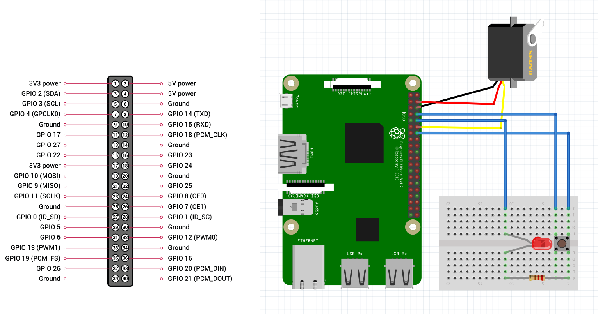

# 라즈베리파이 음성 인식 과제

## 사양

- 버튼으로 녹음

  - 버튼을 누른 경우 음성 녹음 시작

  - 버튼을 뗀 경우 음성 녹음 종료

- 카카오 음성 인식 / 합성 API를 통해 녹음된 음성 처리

  - 인식된 텍스트를 기반으로 장치 제어

    - 날씨 정보 : OpenWeather API를 통해 날씨 정보를 얻어서 카카오 음성 합성으로 안내

    - 문 열기

    - 문 닫기

    - 전등 켜기

    - 전등 끄기

---

## HW 구조

